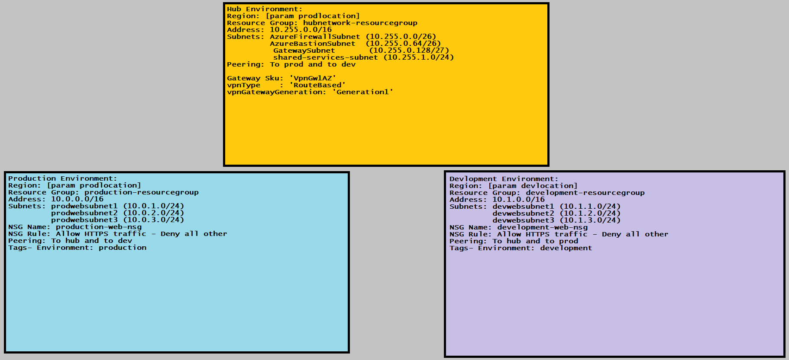

# Azure Hub-and-Spoke Network Infrastructure

This project deploys a modular hub-and-spoke network topology to an Azure subscription using [Bicep](https://learn.microsoft.com/azure/azure-resource-manager/bicep/overview).

It creates separate resource groups and virtual networks for a shared hub, production, and development. Bidirectional VNet peering connects each spoke to the hub, and an optional VPN gateway can provide gateway transit to both spokes.



## Architecture

The deployment creates:

- Three resource groups: hub, production, and development
- A hub VNet with subnets reserved for Azure Firewall, Azure Bastion, a VPN gateway, and shared services
- Production and development spoke VNets, each with three web subnets
- A network security group for each spoke, associated with all three of that spoke's web subnets
- Bidirectional peering between the hub and each spoke
- Optionally, a route-based Azure VPN gateway and Standard public IP in the hub
- Gateway transit from the optional hub gateway to both spokes

The two spokes are not directly peered. This template also does not deploy Azure Firewall, Azure Bastion, workloads, route tables, DNS resources, or an on-premises VPN connection. 

## Address space

| Network | Address space | Subnets |
| --- | --- | --- |
| Production spoke | `10.0.0.0/16` | `10.0.1.0/24`, `10.0.2.0/24`, `10.0.3.0/24` |
| Development spoke | `10.1.0.0/16` | `10.1.1.0/24`, `10.1.2.0/24`, `10.1.3.0/24` |
| Hub | `10.255.0.0/16` | Azure Firewall `10.255.0.0/26`; Azure Bastion `10.255.0.64/26`; Gateway `10.255.0.128/27`; shared services `10.255.1.0/24` |

Each spoke NSG allows inbound TCP/443 traffic from the Azure `Internet` service tag. All other traffic is governed by Azure's default NSG rules.

## Project structure

```text
.
|-- main.bicep                       # Subscription-scope orchestration
|-- modules/
|   |-- gateway.bicep                # Optional VPN gateway and public IP
|   |-- hub-network.bicep            # Hub VNet and subnets
|   |-- nsgs.bicep                   # Reusable network security group
|   |-- spoke-network.bicep          # Production and Development spoke
|   `-- vnet-peering.bicep           # Reusable one-way peering
|-- topology.jpg
`-- README.md
```

## Prerequisites

- An Azure subscription
- Azure CLI with Bicep support
- Permission to create resource groups and network resources at subscription scope

Sign in and select the target subscription:

```powershell
az login
az account set --subscription "<subscription-id-or-name>"
```

## Deploy

Because `main.bicep` targets a subscription, the deployment command needs a deployment location. This location stores deployment metadata; it does not override the Azure regions supplied to the template.

Preview the changes first:

```powershell
az deployment sub what-if `
  --name hub-spoke-network-preview `
  --location westus2 `
  --template-file ./main.bicep `
  --parameters prodlocation=westus2 devlocation=westus2 deployVPNGateway=false
```

Deploy the infrastructure:

```powershell
az deployment sub create `
  --name hub-spoke-network `
  --location westus2 `
  --template-file ./main.bicep `
  --parameters prodlocation=westus2 devlocation=westus2 deployVPNGateway=false
```

Set `deployVPNGateway=true` to deploy the VPN gateway and enable gateway transit on the peerings. VPN gateways incur ongoing charges and can take a significant amount of time to provision.

## Parameters

| Parameter | Type | Default | Description |
| --- | --- | --- | --- |
| `prodlocation` | string | Required | Region for the production and hub resource groups and their resources |
| `devlocation` | string | Required | Region for the development resource group and its resources |
| `deployVPNGateway` | bool | `false` | Deploy the hub VPN gateway and configure gateway transit |
| `productionresourcegroupname` | string | `production-resourcegroup` | Production resource group name |
| `developmentresourcegroupname` | string | `development-resourcegroup` | Development resource group name |
| `hubnetworkresourcegroupname` | string | `hubnetwork-resourcegroup` | Hub resource group name |

For repeatable environment-specific deployments, create a `.bicepparam` file rather than passing every value on the command line.

## Validate

Compile the template locally:

```powershell
az bicep build --file ./main.bicep
```

Validate it against Azure without deploying resources:

```powershell
az deployment sub validate `
  --location westus2 `
  --template-file ./main.bicep `
  --parameters prodlocation=westus2 devlocation=westus2 deployVPNGateway=false
```

## Customization notes

- Resource names and address ranges inside the network modules are currently fixed. Parameterize them before reusing the project for multiple instances in one subscription.
- The hub reserves Azure Firewall and Bastion subnets but does not create those services.
- `allowForwardedTraffic` is disabled on every peering. Enable it and add route tables if you later introduce a firewall or network virtual appliance for routed spoke-to-spoke or inspected traffic.
- The VPN module creates a gateway only. A complete hybrid connection also needs a local network gateway and connection resource, plus the corresponding on-premises configuration.
- Confirm that the selected regions support the requested gateway SKU (`VpnGw1AZ`) before enabling the gateway.

## Cleanup

This project creates three resource groups. Deleting them removes the resources deployed by this template, but it is destructive and also removes anything else later placed in those groups:

```powershell
az group delete --name production-resourcegroup --yes
az group delete --name development-resourcegroup --yes
az group delete --name hubnetwork-resourcegroup --yes
```
