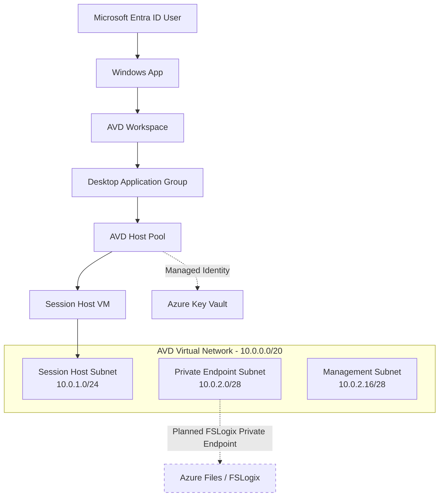

# Azure Virtual Desktop Infrastructure with Bicep

This project deploys a modular Azure Virtual Desktop (AVD) environment using Bicep.

The goal of the project is to build and test an Azure Virtual Desktop platform using Infrastructure as Code while implementing Azure networking, Microsoft Entra ID authentication, managed identities, Azure RBAC, Key Vault, and automated session-host provisioning.

The deployment has been tested end-to-end using the Windows App client with a Microsoft Entra ID user.

> **Project status:** Core AVD infrastructure and automated session-host deployment are working. Azure Files and FSLogix profile storage are the next phase of development.

---

## Architecture



The AVD host pool uses a **system-assigned managed identity**. That identity receives:

- **Key Vault Secrets User** scoped to the Key Vault.
- **Desktop Virtualization Virtual Machine Contributor** scoped to the AVD resource group.

This allows Azure Virtual Desktop to securely retrieve the session-host provisioning credentials from Key Vault and manage the session-host VMs without storing credentials directly in Bicep.

---

## Resources Deployed

The first deployment creates the AVD foundation:

- Azure resource group
- Virtual network
- Session-host subnet
- Private-endpoint subnet
- Management subnet
- Network security groups
- Azure Virtual Desktop pooled host pool
- Desktop application group
- AVD workspace
- Azure Key Vault
- System-assigned managed identity
- Key Vault RBAC assignment
- AVD VM-management RBAC assignment

The second deployment creates and manages the AVD session hosts.

### Current Session Host Configuration

| Setting | Value |
| --- | --- |
| Operating System | Windows 11 Enterprise multi-session 24H2 |
| Join Type | Microsoft Entra ID |
| VM Size | `Standard_D2as_v6` |
| vCPU / RAM | 2 vCPU / 8 GiB |
| OS Disk | Standard SSD LRS |
| Session Hosts | 1 by default |
| Host Pool Type | Pooled |
| Load Balancing | Breadth First |
| Entra SSO | Enabled |
| Region | West US 2 by default |

The current VM sizing is intended for a low-cost lab environment rather than production sizing.

---

## Repository Structure

```text
VirtualDesktop/
├── main.bicep
├── deploySessionHosts.bicep
├── README.md
├── modules/
│   ├── applicationGroup.bicep
│   ├── hostPool.bicep
│   ├── keyVault.bicep
│   ├── keyVaultRoleAssignment.bicep
│   ├── network.bicep
│   ├── nsg.bicep
│   ├── roleAssignment.bicep
│   ├── sessionHost.bicep
│   └── workspace.bicep
└── notes
```

### Deployment Files

`main.bicep` is the subscription-scoped entry point for the base AVD infrastructure.

`deploySessionHosts.bicep` is the second entry point and deploys the automated session-host configuration after the administrator credentials have been stored in Azure Key Vault.

The deployment is intentionally separated into two phases so that the administrator username and password can be inserted into Key Vault outside of Bicep. The actual password is never stored in the repository or passed to the deployment as plaintext.

---

## Network Design

The VNet uses:

```text
10.0.0.0/20
```

Three subnets are currently deployed:

| Subnet | Address Range | Purpose |
| --- | --- | --- |
| Session Hosts | `10.0.1.0/24` | AVD session-host VMs |
| Private Endpoints | `10.0.2.0/28` | Planned Azure Files and other private endpoints |
| Management | `10.0.2.16/28` | Reserved for future management resources |

Each subnet has a dedicated Network Security Group.

The session-host NSG includes rules for AVD HTTPS traffic, AVD UDP relay traffic, Microsoft Entra ID, Azure Monitor, Windows activation, and blocking direct inbound RDP from the Internet.

AVD does not require inbound Internet RDP because the service uses reverse-connect connectivity.

---

## Prerequisites

Before deploying, you need:

- An Azure subscription
- Azure CLI
- Bicep CLI
- Permissions to create Azure resources and RBAC assignments
- Permission to create secrets in Azure Key Vault
- Microsoft Entra ID account for testing AVD access

Required Azure resource providers should also be registered.

Check registration:

```powershell
az provider show --namespace Microsoft.DesktopVirtualization --query registrationState -o tsv
az provider show --namespace Microsoft.Compute --query registrationState -o tsv
az provider show --namespace Microsoft.Network --query registrationState -o tsv
az provider show --namespace Microsoft.KeyVault --query registrationState -o tsv
```

Register a provider if necessary:

```powershell
az provider register --namespace Microsoft.Compute
```

---

# Deployment

## 1. Deploy the Core Infrastructure

From the `VirtualDesktop` directory:

```powershell
az deployment sub create `
  --name avd-prod-deployment `
  --location westus2 `
  --template-file main.bicep
```

The deployment creates the resource group, networking, AVD resources, Key Vault, managed identity, and RBAC assignments.

---

## 2. Get the Key Vault Name

```powershell
$vaultName = az keyvault list `
  --resource-group az-Virtual-Desktop-RG `
  --query "[0].name" `
  --output tsv
```

Verify:

```powershell
$vaultName
```

---

## 3. Add the Session-Host Administrator Username

```powershell
az keyvault secret set `
  --vault-name $vaultName `
  --name avd-admin-username `
  --value "<username>"
```

---

## 4. Add the Administrator Password

Using `Read-Host` prevents the plaintext password from being written directly into PowerShell command history.

```powershell
$securePassword = Read-Host "Enter AVD admin password" -AsSecureString

$password = [System.Net.NetworkCredential]::new(
  '',
  $securePassword
).Password

az keyvault secret set `
  --vault-name $vaultName `
  --name avd-admin-password `
  --value $password

Remove-Variable password
```

The password itself remains stored in Azure Key Vault rather than in Bicep or Git.

---

## 5. Retrieve the Key Vault Secret URIs

Only the secret URIs are passed to the session-host deployment.

```powershell
$avdAdminUser = az keyvault secret show `
  --vault-name $vaultName `
  --name avd-admin-username `
  --query id `
  --output tsv

$avdAdminPassword = az keyvault secret show `
  --vault-name $vaultName `
  --name avd-admin-password `
  --query id `
  --output tsv
```

---

## 6. Deploy the Session Host

Run a What-If deployment first:

```powershell
az deployment sub what-if `
  --name avd-sessionhosts-prod `
  --location westus2 `
  --template-file deploySessionHosts.bicep `
  --parameters `
    environment=prod `
    prefix=avd `
    rgName=az-Virtual-Desktop-RG `
    adminUsernameSecretUri=$avdAdminUser `
    adminPasswordSecretUri=$avdAdminPassword
```

Then deploy:

```powershell
az deployment sub create `
  --name avd-sessionhosts-prod `
  --location westus2 `
  --template-file deploySessionHosts.bicep `
  --parameters `
    environment=prod `
    prefix=avd `
    rgName=az-Virtual-Desktop-RG `
    adminUsernameSecretUri=$avdAdminUser `
    adminPasswordSecretUri=$avdAdminPassword
```

---

## 7. Verify the VM

```powershell
az vm list `
  --resource-group az-Virtual-Desktop-RG `
  --show-details `
  --output table
```

The session host should eventually report a running state.

---

## 8. Assign a User to the Desktop Application Group

In the Azure portal:

```text
Azure Virtual Desktop
    ↓
Application Groups
    ↓
avd-dag-prod
    ↓
Assignments
    ↓
Add
```

Assign the Microsoft Entra ID user that will test the environment.

The Desktop Application Group publishes the full Windows desktop through the `SessionDesktop` resource.

---

## 9. Connect to Azure Virtual Desktop

Open **Windows App** and sign in using the Microsoft Entra ID account assigned to the application group.

The published `SessionDesktop` should appear.

Select the desktop to connect to the AVD session host.

The host pool is configured with:

```text
enablerdsaadauth:i:1
```

which enables Microsoft Entra authentication and single sign-on for the AVD connection.

---

# Security Design

This project uses several security controls:

- Session-host administrator credentials are stored in Azure Key Vault.
- Credentials are not stored in Bicep or committed to Git, and Key Vault secret URI parameters are marked with `@secure()` to avoid exposing them in deployment history.
- The AVD host pool uses a system-assigned managed identity.
- Key Vault uses Azure RBAC authorization.
- The host pool identity receives only the permissions required for Key Vault secret access and VM management.
- Direct inbound Internet RDP is blocked by the session-host NSG.
- Microsoft Entra ID is used to join and authenticate session hosts.
- Private endpoint infrastructure is reserved for Azure Files / FSLogix storage.

---

# Cleanup

The lab is designed so nearly all resources are contained inside one resource group.

Delete the complete environment with:

```powershell
az group delete `
  --name az-Virtual-Desktop-RG `
  --yes `
  --no-wait
```

Check whether deletion has completed:

```powershell
az group exists `
  --name az-Virtual-Desktop-RG
```

When the command returns:

```text
false
```

the resource group has been deleted.

Azure Key Vault uses soft delete. Purge the deleted lab vault if you need to immediately redeploy using the same deterministic vault name:

```powershell
az keyvault purge `
  --name <vault-name> `
  --location westus2
```

Purge protection is intentionally not enabled because this environment is designed as a disposable lab.

---

# Troubleshooting Lessons

Building and deploying this project exposed several real Azure deployment issues, including:

- Azure Key Vault's 24-character naming limit
- Resource-provider registration requirements
- Azure management-plane RBAC versus Key Vault data-plane permissions
- Runtime managed-identity principal IDs
- Deterministic Bicep role-assignment GUIDs
- Marketplace image SKU and exact-version selection
- Subscription-specific VM SKU availability
- Automated AVD session-host provisioning
- Required properties in preview AVD APIs
- Microsoft Entra SSO configuration for AVD
- Network resource deployment concurrency

These issues were resolved through Azure CLI, Bicep What-If deployments, ARM deployment diagnostics, and AVD provisioning-status APIs.

---

# Planned Improvements

The next phase of the project is persistent user-profile storage with **FSLogix and Azure Files**.

Planned additions include:

- Azure Storage Account
- Azure Files share
- FSLogix profile containers
- Azure Files Private Endpoint
- Private DNS zone for `privatelink.file.core.windows.net`
- Storage network restrictions
- FSLogix configuration on session hosts
- AVD scaling plan
- Log Analytics
- Azure Monitor / AVD Insights
- Diagnostic settings and alerts
- Microsoft Entra security-group based application assignments

---

## Notes

This project is intended as a hands-on Azure Virtual Desktop and Infrastructure-as-Code lab.

The environment uses low-cost lab sizing and should not be interpreted as a production sizing recommendation.